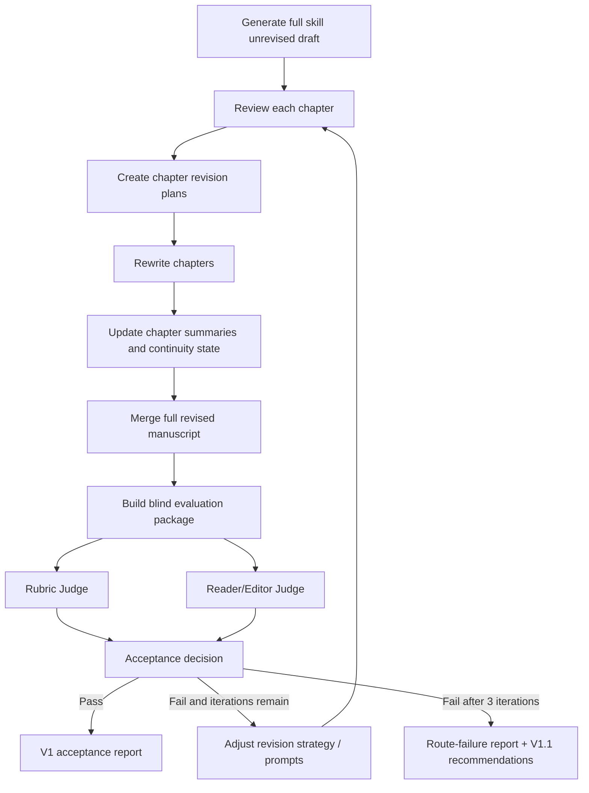

# V1 Chapter Revision Loop Design

## 1. Purpose

V1 turns the current longform-writing skill from a structured first-draft generator into a structured longform writing system with chapter-level review, revision, and blind quality validation.

The goal is not only to prove that the workflow is more traceable than direct writing. The goal is to prove that the workflow can produce better reader-facing longform fiction than direct writing after revision.

## 2. Confirmed Decisions

The design is based on the user-approved option set:

- Main boundary: implement `full skill + chapter-level revision loop`.
- Rubric/judge calibration: allowed only as small clarification changes, and every change must be recorded.
- Revision granularity: V1 uses chapter-level revision first; V1.1 may later add problem-fragment patching.
- Stop condition: `full skill revised` should beat `direct write` in blind real-text quality evaluation.
- Iteration budget: at most 3 full revision/evaluation iterations.
- Primary cases: `case_05` and `case_10`, because direct write previously beat full skill there.
- Regression case: `case_07`, because full skill previously won there and must not degrade.
- Evaluation: two blind internal evaluator agents, one rubric-based and one reader/editor-style.

## 3. Non-Goals

V1 does not implement:

- fragment-level surgical patching;
- fully autonomous rubric evolution;
- genre-specific judge overlays beyond existing routing metadata;
- SFT trajectory-quality scoring;
- external API judging;
- any acceptance standard that rewards engineering artifacts instead of manuscript quality.

If V1 fails after 3 iterations, the task should output a route-failure analysis rather than silently relaxing the target.

## 4. Why V1 Is Needed

Phase D0.5 showed a real gap:

- `full skill` is better at requirement coverage, chapter continuity, clue tracking, and complete reveal structure.
- `direct write` can be better at scene flow, emotional naturalness, dialogue pressure, and genre payoff.

The most important full-skill text-quality issues are documented in:

- `design_context/25_blind_real_text_quality_calibration_report.md`
- `design_context/26_direct_vs_full_skill_text_quality_gap_report.md`

V1 therefore optimizes this target:

```text
Keep full skill's longform control,
then use review/revision to recover direct write's natural reading quality.
```

## 5. High-Level Workflow

```text
full skill draft
  -> chapter quality review
  -> chapter revision plan
  -> chapter rewrite
  -> summary / continuity update
  -> revised full manuscript
  -> blind comparison package
  -> Rubric Judge + Reader/Editor Judge
  -> acceptance decision
  -> if failed, adjust revision strategy and repeat up to 3 iterations
```

Mermaid version:



## 6. New Skill Steps

### 6.1 `review_chapter_quality`

Purpose:

Evaluate a completed chapter as reader-facing fiction.

Inputs:

- `project_brief`
- `relevant_codex`
- current chapter summary
- previous chapter summaries
- current chapter text
- `longform_text_quality_rubric_v1`
- optional genre metadata

Output:

- `chapter_review.json`
- human-readable `chapter_review.md`

Required judgment areas:

- repetition and mechanical evidence logging;
- visible beat expansion;
- scene and prose flow;
- character pressure and emotional arc;
- dialogue function;
- genre payoff;
- continuity safety risks.

Important rule:

The review must cite concrete text evidence. A review without evidence is invalid.

### 6.2 `plan_chapter_revision`

Purpose:

Turn review findings into a bounded chapter rewrite plan.

Inputs:

- `chapter_review.json`
- current chapter text
- chapter summary
- story-so-far context

Output:

- `revision_plan.json`
- human-readable `revision_plan.md`

The plan must separate:

- must-fix issues;
- preserve constraints;
- optional improvements;
- continuity risks;
- target quality gains.

V1 uses whole-chapter rewrite plans, but the plan should still identify problem regions so future V1.1 can use them for fragment-level patching.

### 6.3 `rewrite_chapter`

Purpose:

Rewrite the chapter using the revision plan while preserving story facts and required plot function.

Inputs:

- original chapter text;
- revision plan;
- current chapter summary;
- previous chapter summaries;
- relevant codex;
- text-quality targets;
- preserve constraints.

Output:

- `02_revised_draft.md` for each revised chapter;
- optional `revision_notes.md` explaining what changed.

Core rewrite rules:

- preserve required events and facts;
- remove repetition and visible checklist prose;
- convert evidence into character pressure;
- make dialogue advance conflict, not just information;
- preserve longform continuity;
- do not add new major plot facts merely to improve prose.

### 6.4 `summarize_revised_chapter`

Purpose:

Regenerate post-revision chapter memory so later chapters inherit the revised text, not the unrevised draft.

Inputs:

- revised chapter text;
- original summary;
- previous chapter summaries.

Output:

- `03_summary_after_revised.md`

This prevents the run from improving prose while leaving stale memory behind.

### 6.5 `merge_revised_manuscript`

Purpose:

Build the revised full manuscript.

Output:

- `manuscript/final_revised.md`
- `manuscript/final_unrevised.md` preserved for comparison

The unrevised manuscript must remain available because acceptance compares `full unrevised` versus `full revised`.

## 7. Proposed Run Directory Layout

Each V1 run should keep both original and revised artifacts.

```text
runs/<case>_v1_revision_iter_<n>/
  00_request.md
  01_project_brief.md
  02_codex.json
  03_outline.json
  chapters/
    chapter_01/
      00_summary.md
      01_beats.json
      02_draft.md
      02_revised_draft.md
      03_summary_after.md
      03_summary_after_revised.md
      04_chapter_review.json
      04_chapter_review.md
      05_revision_plan.json
      05_revision_plan.md
      06_revision_notes.md
  manuscript/
    final_unrevised.md
    final_revised.md
  run_records/
    step_manifest.jsonl
    revision_manifest.jsonl
    judge_manifest.jsonl
  acceptance_report.md
```

Iteration-level reports should be stored separately:

```text
revision_eval_runs/v1_chapter_revision/
  iter_01/
  iter_02/
  iter_03/
  private_mapping.json
  final_acceptance_report.md
```

`revision_eval_runs/` should be gitignored if it stores full manuscripts or private mappings.

## 8. Prompt Additions

Add prompt specs under:

```text
longform-writing/core_spec/prompts/
```

Proposed files:

- `12_review_chapter_quality.md`
- `13_plan_chapter_revision.md`
- `14_rewrite_chapter.md`
- `15_summarize_revised_chapter.md`
- `16_merge_revised_manuscript.md`

The prompts should explicitly import the D0.5 lessons:

- avoid repeated object inspection;
- avoid checklist-style deduction unless it is dramatically justified;
- avoid summary-like emotional conclusions;
- turn clues into character pressure;
- improve dialogue pressure;
- preserve longform continuity.

The rewrite prompt should not ask for a generic polish. It should ask for targeted chapter-level revision against concrete review findings.

## 9. Schema Additions

Existing file:

```text
longform-writing/core_spec/schemas/chapter_review.schema.json
```

V1 should inspect this schema and either extend it or add:

```text
longform-writing/core_spec/schemas/chapter_revision_plan.schema.json
longform-writing/core_spec/schemas/revision_acceptance.schema.json
```

Minimum `chapter_revision_plan` fields:

- `chapter_id`
- `must_fix`
- `preserve`
- `rewrite_strategy`
- `continuity_constraints`
- `expected_quality_gains`
- `risk_notes`

Minimum `revision_acceptance` fields:

- case id;
- iteration id;
- blind ranking per judge;
- revealed ranking;
- pass/fail;
- evidence;
- failure reason if failed;
- next iteration strategy if applicable.

## 10. Acceptance Cases

### 10.1 Primary Improvement Cases

Use:

- `test_cases/05_medium_length_single_protagonist.md`
- `test_cases/10_mystery_clue_fairness_smoke.md`

Reason:

Direct write previously beat full skill in both. V1 must show that revision loop can overcome those weaknesses.

### 10.2 Regression Case

Use:

- `test_cases/07_dual_timeline_continuity.md`

Reason:

Full skill previously won because it completed the more complex reveal sequence. V1 must not lose that longform structural advantage.

## 11. Blind Evaluation Design

Each iteration should compare four manuscript variants:

```text
direct write
simple engineered
full skill unrevised
full skill revised
```

Blind package should hide method names as Sample A/B/C/D.

Evaluators:

1. Rubric Judge
   - uses `longform_text_quality_rubric_v1.md`;
   - scores dimensions;
   - provides evidence and revision targets.

2. Reader/Editor Judge
   - does not read the rubric;
   - judges real reading quality;
   - prioritizes naturalness, scene flow, emotional pressure, and payoff.

Both judges must be blind to method mapping and must not inspect source run paths.

## 12. Pass / Fail Rules

### 12.1 Hard Pass

V1 passes if:

- `full skill revised` beats `direct write` overall in blind evaluation;
- `full skill revised` beats `full skill unrevised`;
- `case_05` and `case_10` no longer clearly favor direct write;
- `case_07` does not regress below direct write;
- both judges provide concrete text evidence.

### 12.2 Iteration Pass

An intermediate iteration can continue if:

- `full skill revised` improves over `full skill unrevised`;
- judge evidence identifies actionable remaining gaps;
- no core continuity or plot requirement is broken by revision.

### 12.3 Failure After Budget

After 3 failed iterations, stop and write a route-failure report.

The failure report must answer:

- Did chapter-level rewrite improve full skill over unrevised?
- Why did direct still win, if it did?
- Is the issue prompt quality, revision granularity, context packaging, judge alignment, or the workflow premise?
- Should V1.1 move to fragment-level revision?
- Which direct-write mechanisms should be copied into the next prompt design?

Do not mark V1 successful if direct write still clearly wins.

## 13. Iteration Budget

Maximum iterations:

```text
3
```

One iteration means:

```text
review -> plan -> rewrite -> summarize -> merge -> blind evaluate -> acceptance decision
```

Allowed changes between iterations:

- review prompt wording;
- revision prompt wording;
- revision strategy;
- small judge prompt clarifications;
- small rubric calibration notes.

Disallowed changes:

- changing the evaluation target to make full revised win;
- using method identity in judging;
- rewarding workflow files as manuscript quality;
- deleting hard cases from the acceptance set.

## 14. User Checkpoints During Long Goal

The long-running implementation should not interrupt the user after every chapter.

Report only at these points:

- after first blind evaluation if `full revised` still clearly loses direct;
- after final pass;
- after 3 failed iterations.

Reports should include:

- current ranking;
- specific text-quality failure modes;
- next strategy;
- whether the task is still on track.

## 15. Required Deliverables

Implementation deliverables:

- updated skill workflow docs;
- new prompt specs;
- revision plan schema;
- scripts or runner updates for revision runs;
- blind evaluation package builder for A/B/C/D comparisons;
- run records for each iteration.

Evaluation deliverables:

- per-case `full_unrevised` and `full_revised` manuscripts;
- Rubric Judge output;
- Reader/Editor Judge output;
- V1 acceptance report;
- route-failure report if needed.

Documentation deliverables:

- design report for the implemented revision loop;
- changelog of any rubric/judge prompt calibration;
- summary of direct-write mechanisms absorbed into V1.

## 16. Implementation Order

Recommended order:

1. Add prompt specs and schema updates.
2. Update skill workflow docs to include revision mode.
3. Add or update runner scripts to execute revision loop on existing test cases.
4. Add blind package creation for four-way comparison.
5. Run `case_05` and `case_10`.
6. Run `case_07` regression.
7. Start blind evaluation with two agents.
8. Iterate up to 3 times.
9. Write final acceptance or route-failure report.

## 17. Spec Self-Review

Placeholder scan:

- No placeholders remain.

Internal consistency:

- The stop condition, iteration budget, and accepted calibration scope are consistent across sections.

Scope check:

- The spec is large but bounded: chapter-level revision loop plus evaluation. Fragment-level patching and full rubric evolution are explicitly out of scope.

Ambiguity check:

- The key success criterion is explicit: `full skill revised` must beat `direct write` in blind real-text evaluation, or the task fails after 3 iterations with a route-failure report.
